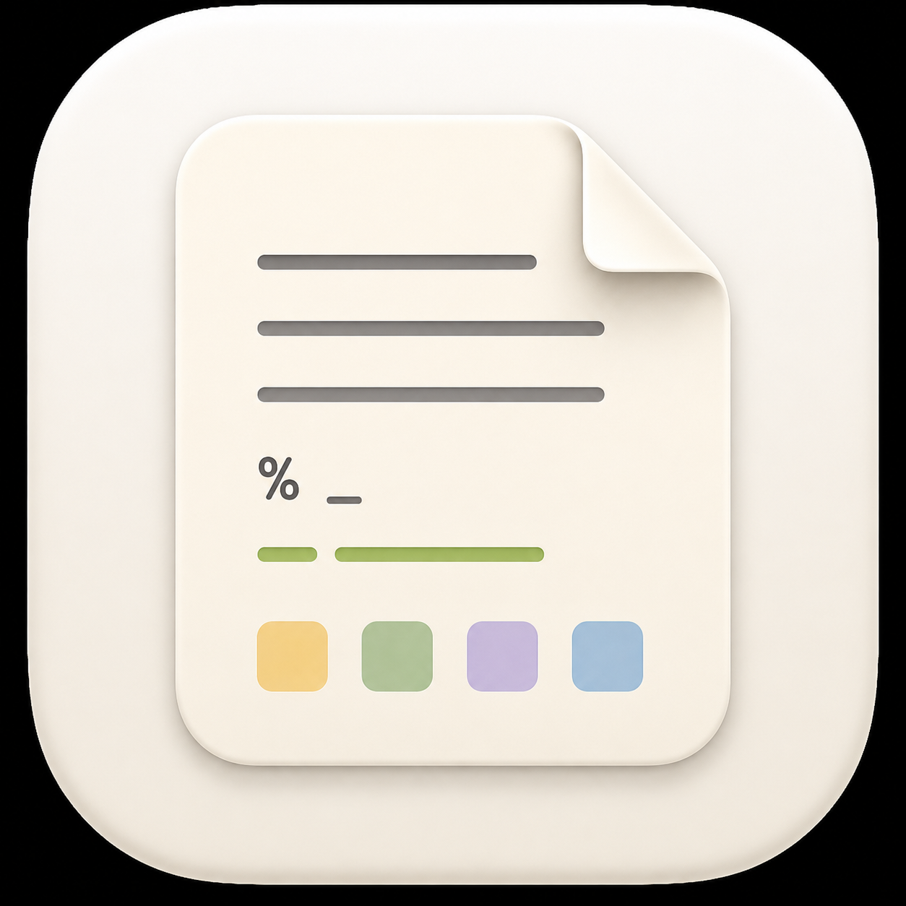

# NiceTextEditor

NiceTextEditor is a small macOS plain-text editor modelled after TextEdit. It is built with SwiftUI and AppKit’s modern `NSTextView` editing widget.



## Features

- Opens and saves plain-text files.
- Uses the macOS proportional system font, SF Pro, by default.
- Lets you configure the proportional font and editor font size from the toolbar or Settings.
- Lets you configure the full-screen text width as a percentage of the screen width.
- Provides an MPW/BBEdit-style UNIX worksheet: each document owns a background `/bin/zsh` process, selected commands can be run in-place, and selected text can be filtered through a prompted pipeline.
- Supports standard macOS find commands: Command-F to search and Command-G / Shift-Command-G to move between matches with wrapping.
- Keeps files as plain text while rendering selected markup regions differently.
- Shows nroff-style verbatim blocks in SF Mono:

```text
This is proportional text.
.VB
This line is shown in SF Mono.
    Indentation is preserved visually.
.VE
Back to proportional text.
```

Only the text between `.VB` and `.VE` is rendered monospace; the marker lines remain normal text and are saved unchanged.

## Requirements

- macOS 14 or later
- Swift 5.9 or later

## Build and run

From the repository root:

```sh
cd nicetexteditor
swift run
```

Build a simple `.app` bundle:

```sh
cd nicetexteditor
make app
open build/NiceTextEditor.app
```

Open the native Xcode project:

```sh
open NiceTextEditor.xcodeproj
```

Or build it from the command line:

```sh
xcodebuild -project NiceTextEditor.xcodeproj -scheme NiceTextEditor build
```

Open a file from the command line:

```sh
cd nicetexteditor
swift run NiceTextEditor /path/to/file.txt
```

## UNIX worksheet

Each document window owns its own background `/bin/zsh` process. It runs inside the editor; Terminal is not launched.

Default worksheet shortcuts:

- Shift-Return: send the selected text to the document shell and insert command output after the selection.
- Command-E: prompt for a zsh command or pipeline, send the selected text as standard input, and replace the selection with stdout/stderr.
- Command-Shift-E: prompt for a zsh command or pipeline, send the selected text as standard input, and insert stdout/stderr after the selection.

The shortcuts are configurable in Settings. A global zsh startup file is created at `~/Library/Application Support/NiceTextEditor/WorksheetStartup.zsh` and sourced before each document shell starts; use it for `PATH`, aliases, functions, exports, and shell options. Settings includes a button to reveal this file in Finder. Use Worksheet > Reset Document Shell to kill and restart the active document's shell and apply shell setup changes.

## Project layout

```text
Package.swift
Info.plist
Makefile
Sources/NiceTextEditor/
```

## License

MIT. See [LICENSE](LICENSE).
